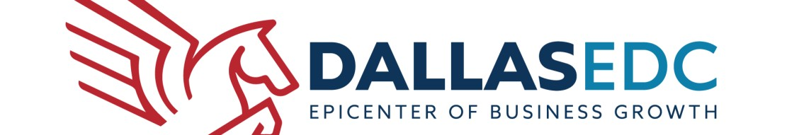

# UTDiscovery x Dallas EDC Data Dashboard
UT Dallas Spring 2026 Capstone project with Dallas EDC, a non-profit in Dallas, TX, to build a data dashboard highlighting the strong education-to-workforce pipeline in the city

# Project Goals and Purpose
- Create a one-stop-shop for showcasing Dallas schools' successes and achievements, challenging the negative narrative that the city doesn't have good schools
- Support Dallas economic development by telling the workforce talent pipeline story to businesses considering relocating or expanding in Dallas
- Connect education, skills, workforce, and industry within a single dashboard
- Highlight Dallas ISD's strengths, including one of the best English as a second language programs in Texas
- Demonstrate how the education system adapts to long-term talent development and workforce outcomes

# Dashboard Enhancements
**General Modifications Needed:**

- Remove schools not in Dallas ISD from the map
- Update school tooltips to show school name at top, physical address, and website (remove latitude/longitude)
- Adjust executive summary to highlight insights about schools, including total number of magnet programs, enrollment and graduation figures, notable programs, school rankings, and key achievements
- Focus summary more on education rather than employment

**Detailed School Information to Add:**

When users click on schools, display:  

- Specialized programs and curriculum offered
- Educational and industry partnerships
- Degree offerings
- Career pathways available
- Equipment and facilities information

**Workforce Pipeline Focus:**

- Highlight P-TECH schools and their programming for highly technical jobs
- Show career pathways from middle/high school through certification for fields like medical, AI, life sciences, and other technical industries
- Include state rankings and performance scores of schools
- Emphasize quality of facilities and learning environments

# Team

- Nicholas Wong
- Reiki Hingorani
- Esther Kim
- Salma Khalfallah
